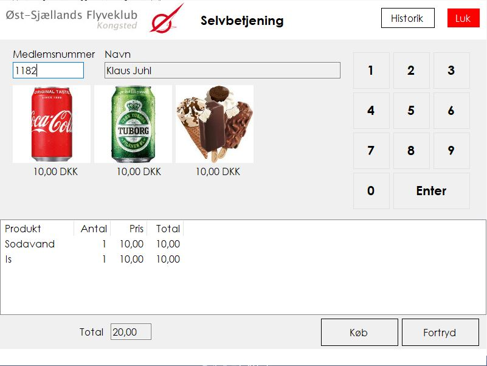
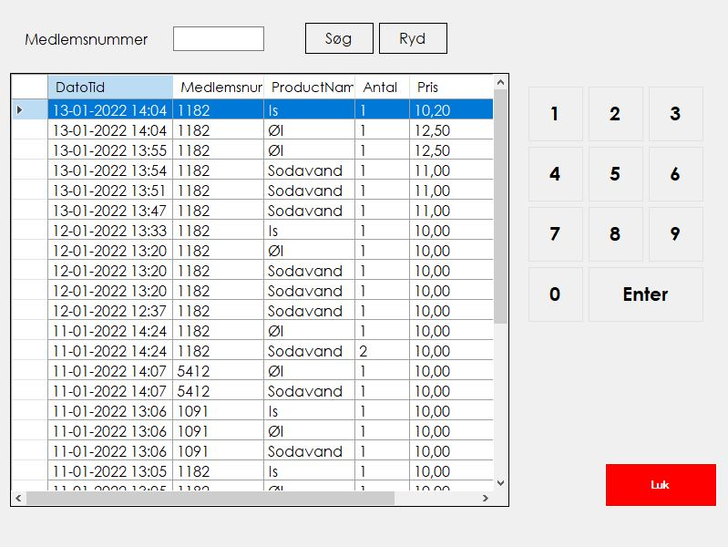

# POS
Self-Service POS (Point-Of-Sale) with integration for Economic

## Background
The purpose of this project has been to provide a simple way for members in a club to purchase sodas and beers from a fridge.
Earlier we used a tally chart to register the purchases and once in a while we manually made invoices in Economic and entered the value of the purchases.

With the Self-Service POS, the purchase is booked directly to a CurrentInvoice in Economic. If there is an existing invoice the purchase is added to same invoice.
From Economic we use BS (MasterCard Payment Services) to claim the money on a monthly basis. 
Since Mastercard charge by the number of invoice lines, we decided to minimize the lines and simply add the value on a single invoice line.

The UI is made for an industrial PC with a touch screen and without any keyboard.

## User manual


In the input field ("Medlemsnummer") the member enters his members number and [Enter]. Use the soft keyboard on the screen. 
The POS will lookup in the Economic Debtor table to verify the account. Members name is shown.

Click on the products you want to purchase. The product is added to to the list and the total value is updated.
When you are done press Purchase ("Køb") and the transaction is comitted to Economic.
The screen is cleared and the system is ready for the next customer.

To see old transactions press the History button ("Historik"). <br>
To end the program click on the red button ("Luk") and enter the secret exit code (requires a keyboard) or enter the exit code in the members number.

### History


The History page shows a list of the last 100 transactions with line details.
Enter a members number in order to filter the list.

## Installation
* Copy the files to Program files\POS 
* Create the two sub folders; images and sound, including the files
* Install the database on a SQL Server 2019
* Create the products in the database. Key-in or use the script to create the products
* Edit the POS.exe.config

## POS.exe.config
In the POS.exe.config file various settings is available:
* LogoPath - path and file name of the logo in the top left corner of the screen
* ProductPath - folder where the product images are saved
* CashRegSoundPath - path and file name of the sound played when a transaction is succesfully booked in Economic
* EconAgreementGrantToken - the Economic Agreement token made by the Economic Admin, to allow the POS access
* EconAppSecretToken - the Economic App token of the developer
* Exitcode - the secret exitcode - remember to make it unique from any members number
* ConnectionString - provide info on the SQL server that holds the POS Transactions used for the history

## Economic interface
Dev agreement + tokens
* [Sign up](https://www.e-conomic.com/developer)
* [Token authentication guide](https://www.e-conomic.com/developer/connect) This explains you how to get tokens (AppSecretToken / AgreementGrantToken) and connect to the APIs.

According to the [Economic Developer Site](http://www.e-conomic.com/developer) the REST API is under development and I was not able to find anything usefull,so I decided to go with the SOAP API.

In C# the econSoap is created as a Connected Service using the https://api.e-conomic.com/secure/api1/EconomicWebService.asmx?wsdl
There is close to no help on which calls to make to it had to be reversed engineered.


```c#
        public static int POSTransaction(string Customer, String ProductPartnumber, int Qty, decimal Price, out string ErrorTxt)
        {
            string OtherRef = "POS";  // Invoice otherref used by the POS aplication
            ErrorTxt = "";
            int ErrorCode = 0;
            
            try
            {

                using (var session = new EconomicWebServiceSoapClient())
                {
                    Connect(session);

                    // Find Debtor
                    var DebtorHandle = session.Debtor_FindByNumber(Customer);

                    if (DebtorHandle is null)
                    {
                        ErrorTxt = "Debtor not found, Number: " + Customer;
                        session.Disconnect();
                        return 1;
                    }

                    var ProductHandle = session.Product_FindByName(ProductPartnumber);
                    if (ProductHandle is null)
                    {
                        ErrorTxt = "Product not found, PartNumber: " + ProductPartnumber;
                        session.Disconnect();
                        return 2;
                    }

                    // Search existing invoice for customer of OtherRef 
                    var currentInvoiceHandles = session.CurrentInvoice_FindByOtherReference(OtherRef);

                    DebtorData InvoiceDebtorData;
                    Boolean InvoiceFound = false;
                    Boolean InvoiceLineFound = false;
                    DebtorHandle InvoiceDebtorHandle;
                    CurrentInvoiceHandle currentInvoiceHandle = default;
                    CurrentInvoiceData currentInvoiceData;
                    CurrentInvoiceLineData currentInvoiceLineData = default;

                    if (currentInvoiceHandles.Length > 0)
                    {
                        // Find Invoice for actual customer
                        for (int i = 0; i < currentInvoiceHandles.Length; i++)
                        {
                            // next invoice
                            currentInvoiceHandle = currentInvoiceHandles[i];
                            currentInvoiceData = session.CurrentInvoice_GetData(currentInvoiceHandle);

                            // Debtor
                            InvoiceDebtorHandle = currentInvoiceData.DebtorHandle;
                            InvoiceDebtorData = session.Debtor_GetData(InvoiceDebtorHandle);

                            if (InvoiceDebtorData.Number == Customer)
                            {
                                InvoiceFound = true;
                                break;
                            }
                        }
                    }

                    if (InvoiceFound)
                    {
                        //CurrentInvoiceLine_FindByCurrentInvoiceList
                        CurrentInvoiceHandle[] CurrentInvoiceHandleArray = new CurrentInvoiceHandle[1];
                        CurrentInvoiceHandleArray[0] = currentInvoiceHandle;
                        var CurrentInvoiceLineHandles = session.CurrentInvoiceLine_FindByCurrentInvoiceList(CurrentInvoiceHandleArray);

                        // Find invoice line
                        for (int line = 0; line < CurrentInvoiceLineHandles.Length; line++)
                        {
                            // next line
                            var currentInvoiceLineHandle = CurrentInvoiceLineHandles[line];
                            currentInvoiceLineData = session.CurrentInvoiceLine_GetData(currentInvoiceLineHandle);
                            var InvoiceLineProductHandle = currentInvoiceLineData.ProductHandle;
                            var ProductData = session.Product_GetData(InvoiceLineProductHandle);

                            if (ProductData.Name == ProductPartnumber)
                            {
                                InvoiceLineFound = true;
                                break;
                            }
                        }

                        if (InvoiceLineFound)
                        {
                            //InvoiceLine found - update Price
                            //Qty unchanged, allways = 1
                            currentInvoiceLineData.UnitNetPrice = currentInvoiceLineData.UnitNetPrice + Price;
                            session.CurrentInvoiceLine_UpdateFromData(currentInvoiceLineData);
                        }
                        else
                        {
                            // Add invoice line
                            ErrorCode=AddInvoiceLine(session, currentInvoiceHandle, ProductHandle[0], ProductPartnumber, Qty, Price, out ErrorTxt);
                        }
                    }
                    else
                    {
                        // Invoice not found - adding invoice
                        var InvoiceHandle = session.CurrentInvoice_Create(DebtorHandle);

                        // Set OtherRef = "Kantine"
                        session.CurrentInvoice_SetOtherReference(InvoiceHandle, OtherRef);

                        // Adding lines
                        ErrorCode=AddInvoiceLine(session, InvoiceHandle, ProductHandle[0], ProductPartnumber, Qty, Price, out ErrorTxt);
                    }

                    session.Disconnect();
                }
                return ErrorCode;
            }
            catch (Exception ex)
            {
                ErrorTxt = "Economic Fejl - " + ex.Message;
                return 99;
            }

        }
```


